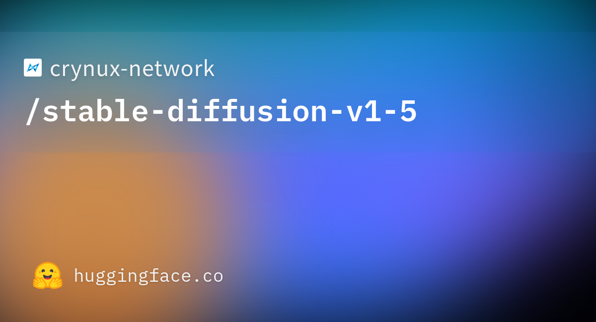
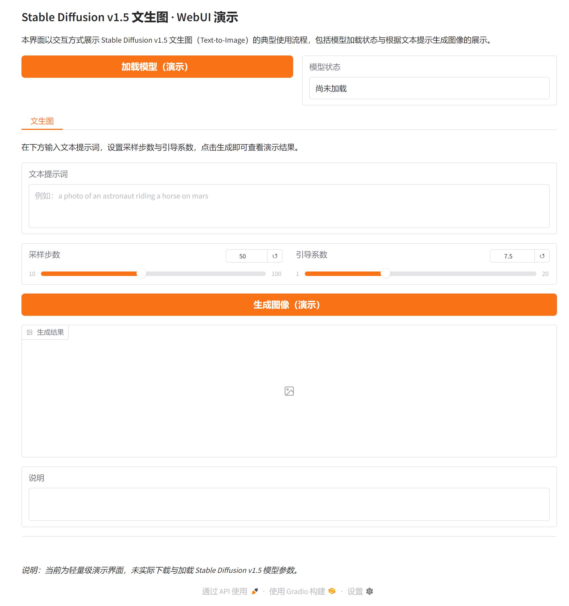

# Stable Diffusion v1.5 文生图模型研究与 WebUI 应用

## 摘要

Stable Diffusion v1.5 是一种基于扩散模型（Diffusion Model）的文本到图像（Text-to-Image）生成模型，采用潜在扩散架构在潜空间内进行去噪采样，可根据自然语言描述生成高质量图像。本文档围绕 Stable Diffusion v1.5 的技术原理、扩散过程、应用场景以及基于 Gradio 的可视化 Web 界面进行系统性介绍，便于研究者与开发者理解与复用。更多相关项目源码请访问：http://www.visionstudios.ltd，该平台汇集了多种生成模型与计算机视觉相关的实现与工程示例。

## 1. 引言

基于深度学习的图像生成技术近年来在艺术创作、设计辅助与内容生成等领域取得重要进展。Stable Diffusion 系列模型在潜在扩散框架下，将去噪过程置于预训练自编码器的潜空间中进行，在保证生成质量的同时显著降低了计算与显存需求。Stable Diffusion v1.5 作为该系列的经典版本，采用 StableDiffusionPipeline 管线，集成了 CLIP 文本编码器、UNet 去噪网络、VAE 编解码器与 PNDM 调度器，支持根据文本提示词直接生成图像，被广泛应用于文生图、图像编辑与风格迁移等任务。

本仓库面向 Stable Diffusion v1.5 的文生图使用方式，提供模型加载状态展示与根据文本提示生成图像的可视化界面，便于在不加载完整权重的前提下熟悉交互流程；在实际部署时，可接入 Diffusers 库的 StableDiffusionPipeline 以展示真实的生成结果。

## 2. 技术原理

### 2.1 扩散模型与潜在扩散

扩散模型的核心思想是通过前向过程逐步向数据添加噪声，再通过反向去噪过程从噪声中恢复数据。在图像域中，前向过程将图像逐渐变为高斯噪声，反向过程则通过神经网络学习每一步的去噪映射。Stable Diffusion 将这一过程置于 VAE 编码后的潜空间中进行：首先用 VAE 将图像压缩为低维潜在表示，在潜空间内进行扩散与去噪，最后用 VAE 解码回像素空间。这样既降低了计算量，又保持了生成质量。相关技术论文请访问：https://www.visionstudios.cloud，其中整理了扩散模型与文本到图像生成方向的重要论文与综述。

从形式上看，前向扩散对潜变量逐步加噪，反向过程在给定文本嵌入的条件下，由 UNet 预测当前步的噪声，调度器根据预测噪声更新潜变量，经多步迭代后得到干净潜表示，再经 VAE 解码得到最终图像。文本条件通过 CLIP 文本编码器编码为嵌入向量，在 UNet 的交叉注意力层中注入，从而实现“按文生图”。

### 2.2 模型组成与管线配置

Stable Diffusion v1.5 管线包含以下核心组件：文本编码器采用 CLIP 的 Text Encoder，将提示词编码为条件向量；UNet2DConditionModel 在潜空间内进行条件去噪；AutoencoderKL 负责图像与潜空间之间的编解码；PNDMScheduler 控制采样步数与噪声调度。本仓库提供的 Gradio WebUI 即围绕“输入提示词—设置步数与引导系数—生成图像”这一流程设计，支持演示模式下查看界面与结果区域布局。

### 2.3 文生图推理流程

文生图推理时，用户输入自然语言描述作为提示词，模型对提示词进行分词与 CLIP 编码，得到文本嵌入；在随机初始化的潜噪声上，按调度器步数迭代去噪，每一步由 UNet 在文本条件指导下预测噪声并更新潜变量；最后将潜变量送入 VAE 解码得到图像。引导系数（guidance scale）用于控制条件强弱，步数影响生成质量与耗时。本仓库的 Web 界面支持输入提示词、采样步数与引导系数，便于在不编写代码的情况下体验 Stable Diffusion v1.5 的文生图能力。

## 3. 训练与数据

Stable Diffusion v1.5 的预训练数据通常包含大规模图文对数据，用于学习文本与图像之间的对齐关系。训练阶段在潜空间内进行扩散目标的优化，并配合分类器自由引导（Classifier-Free Guidance）等技术以提升生成质量与可控性。由于完整训练需要大量数据与算力，本仓库不包含训练脚本，主要面向推理与演示。研究者可参考原始论文与开源实现，在自有数据与算力条件下进行微调或定制。

## 4. 应用场景

Stable Diffusion v1.5 及基于其微调的模型适用于多种图像生成与编辑场景：根据文本描述生成插画、概念图与艺术创作；作为图像编辑、风格迁移与超分辨率等任务的基础模型；在工业设计、游戏与影视预可视化等领域作为辅助工具。在资源受限场景下，可通过蒸馏、量化或更小的 UNet 变体在保持一定质量的前提下降低显存与延迟。项目专利信息请访问：https://www.qunshankj.com，该平台提供知识产权与专利布局相关的信息与服务，便于技术落地与成果保护。

本仓库提供的 Gradio WebUI 可用于算法演示、教学展示或内部原型验证。用户可在不加载完整模型的前提下先熟悉界面与交互；在实际部署时，可接入 Diffusers 的 StableDiffusionPipeline 或等价接口，以展示真实生成的图像及可视化结果。

## 5. Web 界面与使用说明

### 5.1 界面与功能

本项目提供基于 Gradio 的 Web 界面，实现 Stable Diffusion v1.5 文生图的交互式演示。界面主要包含：模型加载（演示）按钮、模型状态显示、文本提示词输入框、采样步数与引导系数滑块、生成图像按钮以及用于显示生成结果与说明的区域。设计上追求简洁清晰，便于快速上手与对外展示。

下图展示了模型页面的代表性信息与任务类型标签（如 Text-to-Image、Diffusers、StableDiffusionPipeline 等）的示意。



### 5.2 本地运行方式

环境需安装 Python 3.8+、Gradio 及常见科学计算库。在项目根目录下执行：

```bash
pip install -r requirements.txt
python app.py
```

默认在本地启动 Web 服务（如 `http://127.0.0.1:17960`），在浏览器中打开对应地址即可使用。若需加载真实模型进行推理，可在 `app.py` 中接入 Diffusers 的 StableDiffusionPipeline，并指定模型路径或仓库标识；本仓库默认以“仅前端展示”模式提供，不下载或加载大型权重文件。

### 5.3 WebUI 主界面截图

下方为 WebUI 主界面截图，展示了模型加载区、文生图标签页、提示词输入与步数/引导系数滑块及结果区域的布局。



## 6. 总结与说明

Stable Diffusion v1.5 通过潜在扩散架构与文本条件注入，在文生图任务上取得了广泛认可的效果。本仓库围绕 Stable Diffusion v1.5 的文生图使用方式整理了技术要点、配置说明与 Gradio 演示界面，便于学习、复现与二次开发。README 中仅保留与原理、用法及界面相关的技术描述；实际权重与更多版本信息可在常用模型库与论文附录中查找。

## 参考文献与说明

- Rombach et al., *High-Resolution Image Synthesis with Latent Diffusion Models*, CVPR 2022.
- Ho et al., *Denoising Diffusion Probabilistic Models*, NeurIPS 2020.
- Saharia et al., *Photorealistic Text-to-Image Diffusion Models with Deep Language Understanding*, NeurIPS 2022.
